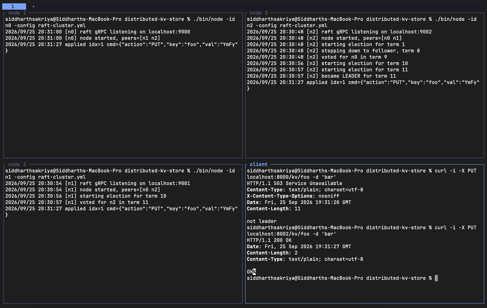

# Distributed KV Store

A distributed, fault-tolerant key-value store built on Raft. Nodes run as separate processes, talk to each other over gRPC, and expose a small HTTP API for clients. Every read and write goes through the replicated Raft log.

[](https://github.com/siddharthsakriya/distributed-kv-store/actions/workflows/ci.yml)

[](https://pkg.go.dev/github.com/siddharthsakriya/distributed-kv-store)

Example of the KV store running in a 3 node cluster:


## Architecture

```
  client (curl / HTTP)
          │
          ▼
┌───────────────────────┐        gRPC (RequestVote / AppendEntries)
│  server.Handler (HTTP)│      ◄──────────────────────────────►  other nodes
│  server.KVServer      │
│    ├─ StateMachine    │ ◄── applyCh ──┐
│    └─ raft.Node ──────┼── Submit ──►  │
└───────────────────────┘   raft log ───┘
          │
          ▼
   FilePersister (data/<id>.state)
```

| Package | Role |
|---------|------|
| `raft/` | Consensus core: election, replication, commit, apply, persistence interfaces |
| `transport/grpc/` | Real network transport (`Transport` client + `Server` handler) over gRPC |
| `proto/` | `raft.v1` protobuf definitions + generated code (built with `buf`) |
| `server/` | KV service layer: `KVServer`, HTTP API, `StateMachine` interface, `FakeKV` |
| `cluster/` | Cluster config loading (`raft-cluster.yml`) |
| `cmd/node/` | The node binary that wires everything together |

## Running a cluster

The cluster is described in `raft-cluster.yml`. Each node has a Raft (gRPC) address and a client (HTTP) address:

```yaml
nodes:
  - id: n0
    addr: localhost:9000         # raft gRPC
    client_addr: localhost:8000  # HTTP API
  - id: n1
    addr: localhost:9001
    client_addr: localhost:8001
  # ...
```

Start each node in its own terminal:

```bash
go run ./cmd/node -id n0
go run ./cmd/node -id n1
go run ./cmd/node -id n2
```

| Flag | Default | Meaning |
|------|---------|---------|
| `-id` | (required) | This node's id, must match an entry in the config |
| `-config` | `raft-cluster.yml` | Path to the cluster config |
| `-data-dir` | `data` | Where Raft state is persisted (`<data-dir>/<id>.state`) |

The nodes elect a leader within a few hundred ms. `Ctrl+C` shuts a node down gracefully. Restarted nodes recover their term, vote and log from disk.

Use an odd number of nodes: a cluster of `2f+1` tolerates `f` failures, so a 6-node cluster tolerates no more failures than a 5-node one.

## KV Store (Disk)

WIP.

## KV Store (In-Memory Version for Now)

The `server` package sits between clients and Raft. It turns HTTP requests into commands, submits them to the Raft log, and replies once they have been committed and applied.

### HTTP API

Send requests to any node's `client_addr`. Only the leader accepts them.

| Method | Path | Body | Success response |
|--------|------|------|------------------|
| `PUT` | `/kv/{key}` | raw value | `OK` |
| `GET` | `/kv/{key}` | – | the value (empty body if the key is missing) |
| `DELETE` | `/kv/{key}` | – | `OK` |

```bash
curl -X PUT localhost:8000/kv/foo -d 'bar'
curl localhost:8000/kv/foo
curl -X DELETE localhost:8000/kv/foo
```

| Status | Meaning | What the client should do |
|--------|---------|---------------------------|
| `503` | This node isn't the leader | Try another node |
| `504` | Not applied within 2s | Retry (the op may or may not have been applied) |
| `500` | Leadership lost, entry overwritten (or other error) | Retry |

GETs also go through the log, not the local map. So a GET reflects every write committed before it, and a stale leader can't serve an old value.

### How a request flows

1. `Handler` builds a `Command{Action, Key, Val}`, JSON-encodes it and calls `KVServer.Submit`.
2. `Submit` calls `raft.Node.Submit`. If this node isn't the leader it returns `ErrNotLeader` straight away.
3. Otherwise it registers a **waiter** under the returned log index, recording the term. The waiter is registered while holding the lock, so the apply loop can't signal before it exists.
4. `RunApplyLoop` drains `applyCh` and applies each entry to the `StateMachine`. If a waiter is registered at that index, it hands the result back.
5. **Index + term matching:** if the entry applied at an index has a different term from the one the waiter recorded, another leader overwrote the entry. The waiter then gets `ErrLostLeadership` instead of someone else's result.
6. If nothing arrives within 2 seconds, the waiter is removed and `Submit` returns `ErrTimeout`.

### State machine

```go
type StateMachine interface {
    Apply(cmd []byte) []byte
}
```

`KVServer` holds this interface, never a concrete type. `FakeKV` is the current in-memory implementation (`map[string][]byte`) and handles `PUT`, `GET` and `DELETE`. Anything else returns `action not allowed`, and undecodable input returns `bad command`.

## Raft

An implementation of the [Raft consensus algorithm](https://raft.github.io/raft.pdf) in Go. Raft keeps a replicated log consistent across a cluster of nodes so that they agree on the same ordered sequence of commands, even as nodes fail.

The `raft` package is a standalone consensus core: it replicates an opaque log of commands and hands committed entries back to the application. It knows nothing about what those commands mean. That's the job of the state machine on top of it.

### Design

The package talks to the outside world through three interfaces, so it stays decoupled from transport, storage, and the state machine:

| Interface / type | Role |
|------------------|------|
| `Transport`      | Sends `RequestVote` / `AppendEntries` RPCs to peers |
| `RPCHandler`     | Receives them (`*raft.Node` implements it; the gRPC server delegates to it) |
| `Persister`      | Saves and loads persistent state (term, vote, log) |
| `ApplyCh`        | Channel the node pushes committed `ApplyMsg`s onto |

A node is driven by two touchpoints:

- **`Submit(command)`**: the application hands in a command. The leader appends it to its log, persists it, and returns an `{Index, Term, IsLeader}` receipt. It does **not** block for commit.
- **`ApplyCh`**: the node delivers committed commands in index order as `ApplyMsg{Index, Term, Command}`. The application watches this to learn what has committed.

### Usage

```go
cfg := raft.Config{
    ID:        "n0",
    Peers:     []string{"n1", "n2"},            // other node ids
    Transport: myTransport,                     // implements raft.Transport
    Persister: raft.NewFilePersister(path),     // implements raft.Persister (may be nil)
    ApplyCh:   applyCh,                         // chan raft.ApplyMsg (may be nil)
}

node := raft.NewNode(cfg)
node.Start()
defer node.Stop()

// on the leader:
res := node.Submit([]byte("some command"))
if res.IsLeader {
    // watch applyCh for res.Index (and check res.Term) to know it committed
}

// drain committed entries:
for msg := range applyCh {
    // apply msg.Command to your state machine
}
```

Log indices are 1-based (index 0 means "before the log"), matching the paper.

### Package layout

| File | Contents |
|------|----------|
| `state.go`            | `Node`, `Config`, `LogEntry`, `Role`, `NewNode` |
| `election.go`         | election timer, `startElection`, `HandleRequestVote`, log helpers, `persist` |
| `replication.go`      | `Submit`, replication loop, `HandleAppendEntries`, `advanceCommitIndex` |
| `apply.go`            | apply loop, `ApplyMsg` |
| `lifecycle.go`        | `Start` / `Stop` |
| `rpc.go`              | RPC argument / reply structs |
| `transport.go`        | `Transport` / `RPCHandler` interfaces |
| `transport_fake.go`   | in-memory `FakeTransport` for tests (connect / disconnect nodes) |
| `persister.go`        | `Persister` interface |
| `persister_file.go`   | `FilePersister`: durable on-disk persister |
| `persister_fake.go`   | `FakePersister`: in-memory persister for tests |

## Development

```bash
make test    # run tests
make race    # run tests with the race detector
make vet     # go vet
make build   # compile
```

CI (build, vet, gofmt check, and `go test -race`) runs on every push and pull request.

## Reference

- [In Search of an Understandable Consensus Algorithm (Extended Version)](https://raft.github.io/raft.pdf), Ongaro & Ousterhout
